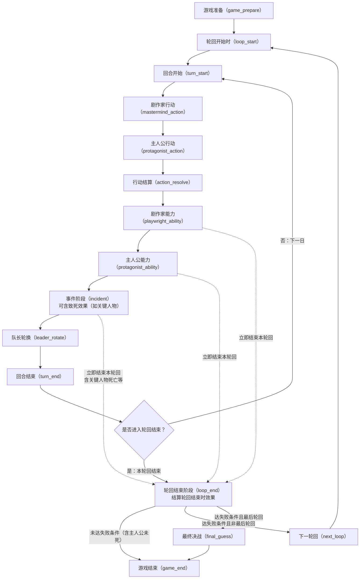

# 惨剧轮回游戏规则（单页切换升级版）

## 一、胜利条件
- 惨剧轮回是 1 名剧作家对战 3 名主人公的游戏。
- 主人公胜利条件A：在某一轮轮回结束时，不满足失败条件且主人公未死亡。
- 主人公胜利条件B：在最终决战中获胜。
- 达成A或B任一条件即为主人公胜利。
- 剧作家胜利条件：所有轮回均使主人公达成失败条件或死亡，且未在最终决战中失败。

## 二、游戏准备
- **剧本**：游戏的基础信息集合，由**公开信息表**与**非公开信息表**共同构成（与术语表「剧本」一致）。
- 剧作家选定**剧本模组**后，须同时完备两面表；向主人公**发放并宣读公开信息表**，并自行掌握、核对**非公开信息表**。两面信息须同源；公开/非公开边界冲突时，以**非公开信息表**为准。
- **公开信息表**（对主人公与剧作家公开）：须含——**剧本模组**；各**事件名称**及**发生天数**（**不含当事人**）；**剧本轮回数**；**每轮回天数**；**剧本特殊规则**（若有）。为便于实际开局，通常还应摘要：**公共牌池**（可用牌与「每轮回限1次」）、**可登场角色池**（角色名、初始区域、不安限度、公开友好能力等）。
- **非公开信息表**（仅剧作家）：除公开表已列内容外，还须含——各事件的**当事人**；剧本所采用的**规则 X**、**规则 Y**（合称**剧本规则**，一般为一则规则 Y 与两则规则 X，以具体模组为准）；**登场角色**及每名角色的**剧本角色身份**真值与隐藏触发细节。
- **剧本须覆盖信息（核对清单）**：①剧本模组 ②剧本轮回数、每轮回天数 ③事件（名称、天数；非公开侧写当事人）④剧本规则与身份池 ⑤登场角色与剧本角色身份（平民数量不限；非平民依剧本规则与身份上限孰严）⑥剧本特殊规则（若有，优先级最高）⑦对局执行：公开宣读用语下的牌池与可登场角色摘要。
- **确认目标选择** 游戏中友好能力如可选取目标，目标由当前队长选择，其他能力以及事件如可选取目标，由剧作家选择。规则文本另有说明的除外

## 轮回结束与分流
- **轮回结束触发（满足其一即可）**：最终日**回合结束**后进入 **轮回结束阶段（`loop_end`）**，结算「轮回结束时」类效果，并在 `loop_end` 最末尾执行胜负分流；某些效果强制结束本轮回（先进入 `loop_end`）；主人公死亡。
- **失败与死亡（关键人物等）**：角色于**任意阶段**死亡时，须按附录结算其身份上的「该角色死亡时」等强制效果。若条文写明**主人公失败**（如常见模组中**关键人物**死亡），则于该效果结算完毕之时**直接视为已达成本轮回的失败条件**，进入 `loop_end` 后在末尾按「达失败条件」分流，**不因发生在事件阶段等而推迟认定**。
- **跨阶段**：若在剧作家能力、主人公能力或**事件阶段**触发**立即结束本轮回**（含事件效果致死进而触发「该角色死亡时」等），则跳过当日内后续阶段，直接进入 **`loop_end`（轮回结束阶段）**，并在其末尾分流（与本文状态机**虚线**一致）。
- **分流**：未达任何失败条件（且主人公未死）→ 游戏结束，主人公胜（条件 A）；达失败条件且非最后轮回 → 下一轮回；达失败条件且最后轮回 → 最终决战后定胜负。

## 页面交互说明
- 左侧目录分为：流程与附录。
- 点击流程项时，右侧仅显示该流程面板。
- 点击附录项时，右侧显示附录完整区块。
- 模组子目录归属“附录B：模组表（总览）”，默认折叠，点击后展开；点击某个模组时右侧仅显示该模组表格。

## 状态机（Mermaid）
完整交互与式样见单页 HTML（`docs/tragedy_loop_game_rules.html`）“生命周期总览”。以下为与生成页同源的流程图，便于在 Markdown 侧预览：

## 流程规则（细化模板）
### 0. 游戏准备（game_prepare）
- **输入**: 完整剧本（公开信息表+非公开信息表）、剧本候选（含剧本模组）、玩家人数（1剧作家+3主人公）、基础规则与组件
- **前置条件**: 已确认参与者与主持方式；准备进入开局前信息配置
- **执行步骤**: 1) 选定剧本模组并完备两份表 2) 向主人公发放并宣读公开信息表 3) 剧作家核对非公开信息表（当事人、剧本规则、登场角色与身份等） 4) 按核对清单确认轮回数、天数、事件与剧本特殊规则
- **冲突处理/优先级**: 信息冲突以剧本表为准；公开/非公开边界冲突由非公开信息表裁定；一般情况下文本“不能”优先于“能”
- **结算输出**: 已锁定剧本与信息边界，可进入轮回开始时（loop_start）
- **跳转条件**: 准备完成后进入 loop_start；若关键数据缺失则停留本阶段补齐

### 0.5 轮回开始时（loop_start）
- **输入**: 当前轮回编号、剧本公开/非公开边界摘要、登场角色与初始区域、牌池与组件就绪状态
- **前置条件**: 剧本已在 game_prepare 就绪；后续轮回须完成 next_loop 分流
- **执行步骤**: 1) 时之裂隙内主人公玩家讨论 2) 登场角色就位；指示物原则上清空，跨轮保留以规则为准 3) 分发手牌等开战组件（若规则置于首日前则并入本节点），每轮回一次的卡牌回收到原主人手中 4) 结算「轮回开始时」触发效果
- **冲突处理/优先级**: 强制效果优先；与指示物清空冲突时以允许跨轮保留之条文优先
- **结算输出**: 轮回首日 turn_start 前稳定状态快照
- **跳转条件**: 完成后进入 turn_start；若效果导致轮回提前结束则进入 `loop_end`，并在其末尾分流

### 1. 回合开始阶段（turn_start）
- **输入**: 上一回合结束状态、当前轮回天数、回合开始触发队列
- **前置条件**: 轮回未结束；当前天数合法；角色/版图状态有效
- **执行步骤**: 1) 结算“回合开始”触发效果 2) 同步状态日志 
- **冲突处理/优先级**: 强制效果优先；同优先级按声明顺序；不可执行效果记为跳过
- **结算输出**: 回合开始后的状态快照
- **跳转条件**: 正常进入剧作家行动阶段；若触发立即结束本轮回则进入 `loop_end`，并在其末尾分流

### 2. 剧作家行动阶段（mastermind_action）
- **输入**: 剧作家手牌、可选目标（角色/版图）
- **前置条件**: 需可放置3张；尸体不可作为角色目标；同位不可叠2张及以上
- **执行步骤**: 剧作家暗置3张行动牌，同一个可放置行动牌的区域只能放置一张剧作家手牌，并锁定放置位
- **冲突处理/优先级**: 目标合法性先校验，非法放置拒绝提交
- **结算输出**: 剧作家放置结果（隐藏信息）
- **跳转条件**: 进入主人公行动阶段

### 3. 主人公行动阶段（protagonist_action）
- **输入**: 主人公手牌、队长顺序、已放置卡位
- **前置条件**: 3位主人公每人1张；不可叠在其他主人公卡位；可叠在剧作家卡位
- **执行步骤**: 按队长起顺时针依次暗置行动牌
- **冲突处理/优先级**: 顺序严格执行；越权或超额放牌拒绝
- **结算输出**: 当日6张行动牌放置完成
- **跳转条件**: 进入行动结算阶段

### 4. 行动结算阶段（action_resolve）
- **输入**: 阶段2/3放置的全部行动牌
- **前置条件**: 牌面翻开完成；目标仍合法可结算
- **执行步骤**: 查看手牌表中的手牌效果并按效果结算（先处理移动，再处理其它效果）；最后将“每轮一次”手牌放入弃牌堆，其他手牌回到原主人手中。
- **冲突处理/优先级**: 移动类 > 非移动类；同类按规则文本优先级与顺序处理
- **结算输出**: 行动结算后的状态快照（角色、版图、标记、卡牌状态）
- **跳转条件**: 进入剧作家能力阶段

### 5. 剧作家能力阶段（playwright_ability）
- **输入**: 非公开信息表中存在的规则、身份或能力（且满足触发条件）
- **前置条件**: 能力触发窗口为本阶段；资源与目标满足条件；声明内容必须在非公开信息表中可追溯
- **执行步骤**: 先同步结算全部强制能力，再由剧作家以任意顺序声明并结算任意能力
- **冲突处理/优先级**: 强制 > 任意；同级按声明顺序；非法声明（不在非公开信息表中）无效
- **结算输出**: 能力结算后的状态快照
- **跳转条件**: 若能力导致轮回结束则直接进入 `loop_end`，并在其末尾分流；否则进入主人公能力阶段

### 6. 主人公能力阶段（protagonist_ability）
- **输入**: 友好值、可用友好能力、可拒绝能力集合
- **前置条件**: 仅队长声明；能力阈值满足
- **执行步骤**: 队长声明能力 -> 剧作家处理/拒绝 -> 循环直至结束
- **冲突处理/优先级**: 可拒绝项由剧作家裁定；若角色带有“无视友好”特性，剧作家可选择是否拒绝；被拒绝后限次仍消耗；一般情况下“不能”优先于“能”；
- **结算输出**: 能力结算后的状态快照
- **跳转条件**: 若能力导致轮回结束则直接进入 `loop_end`，并在其末尾分流；否则进入事件阶段

### 7. 事件阶段（incident）
- **输入**: 当日预定事件、当事人、角色不安值与存活状态
- **前置条件**: 存在预定事件；当事人存活；不安值达阈值
- **执行步骤**: 先判定事件是否发生，若发生则必须执行事件效果（效果可包含角色死亡；若为**关键人物**等且触发「该角色死亡时」之**主人公失败**，则**当场视为已达失败条件**，并可触发立即结束本轮回，**跨阶段**进入 `loop_end`，并在其末尾分流）
- **冲突处理/优先级**: 判定先于效果执行；指定对象默认由剧作家选择
- **结算输出**: 能力结算后的状态快照
- **跳转条件**: 若事件/效果导致轮回结束则直接进入 `loop_end`，并在其末尾分流；否则进入队长轮换阶段

### 8. 队长轮换阶段（leader_rotate）
- **输入**: 当前队长编号
- **前置条件**: 编号有效且存在3名主人公
- **执行步骤**: 1 -> 2 -> 3 -> 1轮换
- **冲突处理/优先级**: 编号异常时阻断并报错
- **结算输出**: 新队长编号
- **跳转条件**: 进入回合结束阶段

### 9. 回合结束阶段（turn_end）
- **输入**: 当日结算状态、天数、轮回剩余天数
- **前置条件**: 当日其它阶段已完成
- **执行步骤**: 处理回合结束触发；推进天数或结束轮回
- **冲突处理/优先级**: 结束触发优先于天数推进
- **结算输出**: 下一日入口状态或轮回结束状态
- **跳转条件**: 非最终日 -> turn_start；最终日 -> `loop_end`，并在其末尾分流

## 术语清单（草案）
### 阶段与状态机术语
| 术语 | 建议定义（草案） | 来源 | 需你确认 |
| --- | --- | --- | --- |
| game_prepare | 开局前的准备节点：确认剧本与公开/非公开信息边界。 |  |  |
| 轮回 | 从轮回准备开始到轮回结束判定完成的一整次循环。 |  |  |
| 阶段 | 流程中的单个结算窗口，按固定顺序依次执行。 |  |  |
| 回合 | 游戏内一天的完整流程，包含九个阶段。 |  |  |
| 最终决战 | 最后轮回失败后触发的身份推理判定流程。 |  |  |
| 最终日 | 当前轮回的最后一天 |  |  |
| loop_end 末尾判定 | 在轮回结束阶段所有能力结算后执行的胜负分流。 |  |  |
| 信息边界 | 确认剧本与公开/非公开信息边界。游戏过程中，行动结算，每个身份能力结算，每个角色能力结算，每个事件的结算视为一次结算，剧作家只需在整次结算完成后，告知主人公结果，如标志物的增减，角色的移动和死亡，事件的发生与否，事件的现象（事件发生但无现象则需告知事件无现象），胜利，失败（需告知是主人公死亡还是主人公失败），EX槽的变化，角色技能的拒绝（仅告知拒绝，不告知具体特性），特殊剧本中还有手牌的变动和世界线的变动，不需告知细节。 |  |  |
| 原子结算 | 一次不可分割的结算单元。结算内部按文字说明顺序执行；无明确说明（如"随后"）的效果视为**同时生效**。同时生效时：先读取当前状态确定所有效果目标和数值，再一次性写入状态变更，最后处理触发效果（如死亡触发）。原子结算类型：①同阶段全部强制能力 ②一张行动牌效果 ③一次剧作家任意能力 ④一次主人公友好能力 ⑤一个事件的完整效果 ⑥回合结束强制能力（杀人狂）。 |  |  |
| 同时裁定 | 一次原子结算中同时产生「主人公死亡」和「主人公失败」时：仅报送主人公死亡（死亡优先）。若主人公死亡被阻止（如军人技能）且存在主人公失败，则报送主人公失败。若主人公死亡被阻止且无失败触发，则无终局效果。 |  |  |

### 对象与区域术语
| 术语 | 建议定义（草案） | 来源 | 需你确认 |
| --- | --- | --- | --- |
| 角色 | 规则作用的单位，可放置行动牌、移动并参与事件判定。 |  |  |
| 特性 | 角色带有的特殊特性 |  |  |
| 版图 | 由实体版图/`board.json` 网格定义的场所集合（如医院、学校、都市等格子）。**远方不属于版图**，仅为版图外的特殊区域合集。 |  |  |
| 远方 | 版图外的特殊区域合集，**不是版图上的某一格**。角色可位于远方，但不参与基于网格的相邻与横/竖/斜移动；版图密谋等仅针对版图格子（具体协议以卡牌/能力/事件文本为准）。 |  |  |
| 尸体 | 处于死亡状态的角色；除非规则明确以尸体为目标，否则不能以尸体为目标：尸体不进行事件发生判定。 |  |  |
| 相邻区域 | 横向或竖向相邻的版图格子（远方等非版图区域不适用此关系）。 |  |  |
| 初始区域 | 角色在登场时所处的区域，如果有多个初始区域按照剧本设定的区域为准，特例手下，以其特性说明为准|  |  |
| 禁行区域 | 该角色不能通过任何方式到达的区域。某些技能可以取消禁行区域|  |  |
| 移除 | 在游戏 |  |  |
| 移动 | 变换角色所处区域。在版图格子上时遵循网格移动；**远方不是版图格**，进出远方及与版图的关系以具体效果为准（不得将远方当作版图格参与邻接判定）。 |  |  |
| 当事人 | 与某事件绑定并用于判定事件是否发生的指定角色。 |  |  |

### 指示物、标志与计数术语
| 术语 | 建议定义（草案） | 来源 | 需你确认 |
| --- | --- | --- | --- |
| 不安指示物 | 放置在角色身上的指示物用于事件触发阈值判定的计数标记。 |  |  |
| 密谋指示物 | 放置在版图或角色上的指示物，用于失败条件、能力和事件判定的核心计数标记。 |  |  |
| 友好指示物 | 放置在角色身上的指示物用于声明主人公能力及其阈值校验的计数标记。 |  |  |
| 希望指示物 | 放置在角色身上的指示物，由扩展规则引入、用于额外判定的对立标记。具体效果以手牌表为准 |  |  |
| 绝望指示物 | 放置在角色身上的指示物，由扩展规则引入、用于额外判定的对立标记。具体效果以手牌表为准 |  |  |
| 护卫指示物 | 放置在角色身上的指示物，放置护卫指示物的角色死亡时，移除护卫指示物代替其死亡处理。 |  |  |

### 标记、标志与计数术语
| 术语 | 建议定义（草案） | 来源 | 需你确认 |
| --- | --- | --- | --- |
| 已沟通标志 | 角色第一次发动技能时（不论来源方，不论是否被拒绝）全局增加一个已沟通标志 |  |  |
| 已死亡标志 | 角色第一次死亡时全局增加一个已死亡标志 |  |  |
| 领地标志 | 标志大人物的领地 |  |  |

### 标记与计数术语
| 术语 | 建议定义（草案） | 来源 | 需你确认 |
| --- | --- | --- | --- |
| 每轮回限1次 | 能力或效果或卡牌在同一轮回内最多结算或使用一次的限制标签。 |  |  |

### 能力与时点术语
| 术语 | 建议定义（草案） | 来源 | 需你确认 |
| --- | --- | --- | --- |
| 强制能力 | 触发条件满足时必须立即执行、不可主动跳过的能力。 |  |  |
| 任意能力 | 触发条件满足时可由拥有方选择是否执行的能力。 |  |  |
| 拒绝 | 剧作家对可拒绝能力作出的否决处理，能力不生效，此时，剧作家必须告知主人公技能发动失败。 |  |  |
| 触发窗口 | 某能力被允许声明并结算的阶段时点范围。 |  |  |

### 胜负与事件术语
| 术语 | 建议定义（草案） | 来源 | 需你确认 |
| --- | --- | --- | --- |
| 失败条件 | 轮回结束时用于判定主人公是否失败的条件集合，包括主人公失败和主人公死亡两种类型。 |  |  |
| 主人公失败 | 失败条件的一种 |  |  |
| 主人公死亡 | 失败条件的一种，可被特殊能力（如军人技能阻挡）  |  |  |
| 分流 | 轮回结束后在继续轮回、最终决战或游戏结束之间选择分支。 |  |  |
| 结果告知粒度 | 胜负/失败结果为必告知项；失败细因按信息边界可不公开。 | data/特别说明.txt | 是 |

### 剧本术语
| 术语 | 建议定义（草案） | 来源 | 需你确认 |
| --- | --- | --- | --- |
| 剧本 | 游戏的基础信息集合，包括了公开信息表和非公开信息表。 |  |  |
| 剧本模组 | 决定当前剧本选用的模组。 |  |  |
| 公开信息表 | 向主人公和剧作家公开的表格：须载明剧本模组；各事件名称及发生天数；剧本轮回数；每轮回天数；剧本特殊规则（若有）。 |  |  |
| 非公开信息表 | 仅向剧作家公开的表格：除公开信息表已列内容外，还须包含——①各事件的当事人；②剧本所采用的规则 Y 与规则 X；③所有登场角色及其非公开细节。 |  |  |
| 剧本规则 | 剧本非公开信息表中的规则 X 与规则 Y 条目集合，决定身份池与失败条件等；一般为一条规则 Y、两条规则 X（以具体模组与剧本为准）。 |  |  |
| 登场角色 | 由非公开信息表设定的、本局实际登场的角色。 |  |  |
| 剧本轮回数 | 剧本设定的轮回数，从 1 开始计数。 |  |  |
| 剧本天数 | 剧本设定的每轮回天数，从 1 开始计数。 |  |  |
| 剧本特殊规则 | 剧本设定的特殊规则，优先级最高；常见如禁止部分卡牌或能力、取消某些「每轮回限 1 次」、重排版图等。 |  |  |
| 剧本角色身份 | 非公开信息表为每名登场角色配置的身份。除平民外，各身份数量须符合剧本规则给出的身份池；若与身份数量上限冲突，以上限为准。平民身份数量可为任意。 |  |  |
| 平民 | 无特殊能力的身份。 |  |  |

### 触发标签与节点（摘要）
| 术语 | 建议定义（草案） | 来源 | 需你确认 |
| --- | --- | --- | --- |
| 剧本制作时 | 剧本必须符合剧本制作时的规则，如剧本设定规则Y“和我签订契约吧”，则关键人物身份对应的角色必须带有少女属性 |  |  |
| 轮回开始时（触发标签） | 映射到生命周期节点 `loop_start`（每轮回进入首日回合前的窗口）。 | 规则文档状态机 | 否 |
| 常驻 | 该效果游戏过程全程生效 |  |  |
| 最终日 | 剧本设定的每轮回中的最后一天，如剧本设定天数为5，则第五天为最终日 |  |  |
| 强制 | 该效果必须发生 |  |  |

### 规则裁定术语
| 术语 | 建议定义（草案） | 来源 | 需你确认 |
| --- | --- | --- | --- |
| 结果公开 | 剧作家只需向主人公告知结算结果，不强制公开中间过程与推导链路。 | data/特别说明.txt | 是 |
| 过程非公开 | 在不影响规则正确执行前提下，过程信息默认不公开，仅保留结果公告。 | data/特别说明.txt | 是 |
| 文本冲突（能/不能） | 同一窗口内“能”与“不能”冲突时，按当前补充口径处理为“不能优先于能”（待最终裁定）。 | data/特别说明.txt | 是 |
| 失败原因隐藏 | 失败进入下一阶段时可仅声明“失败”，不强制披露触发了哪条失败条件。 | data/特别说明.txt | 是 |
| 裁定日志 | 服务端保留完整裁定依据与过程日志；客户端按信息边界仅见可见结果。 | 信息边界规则 | 是 |

### 模组术语
| 术语 | 建议定义（草案） | 来源 | 需你确认 |
| --- | --- | --- | --- |
| 规则 | 模组中规则X和规则Y的合集，剧本从中规则。 |  |  |
| 身份 | 模组带有的身份列表，以及其特殊能力。 |  |  |
| 事件 | 模组带有的事件列表，以及其效果。 |  |  |
| 不死 | 带有该属性的角色不会死亡 |  |  |
| 模组特殊规则 | 模组的特殊规则，剧本选择模组后，同时也会带有相应的模组特殊规则 |  |  |
| 群众事件 | HSA的特殊规则，群众事件的当事人并非1名角色，而是指定了1块版图，所指定的版图中所有群众即为事件的当事人（例：“诅咒活化”当事人被指定为“学校群众”）
当版图中有着等于或超过事件规定的尸体数量时，事件就会发生
根据HSA模组特殊规则
（版图上的[密谋]也视作尸体） |  |  |
| 世界移动 | AHR的特殊规则，更改当前的世界线 |  |  |
| EX槽 | 模组的特殊规则中用于额外标记的标记槽，初始为0 |  |  |
| EX牌 | 模组的特殊规则中用于额外标记的标记牌，分为ABCD四张 |  |  |

## 附录入口
- **书面附录全文**：`tragedy_loop_appendix.md`
- 附录A：手牌表（面板 `appendix_cards`）
- 附录B：模组表总览（面板 `appendix_modules`）与模组子目录（`module_*`）
- 附录C：角色表（面板 `appendix_roles`）
