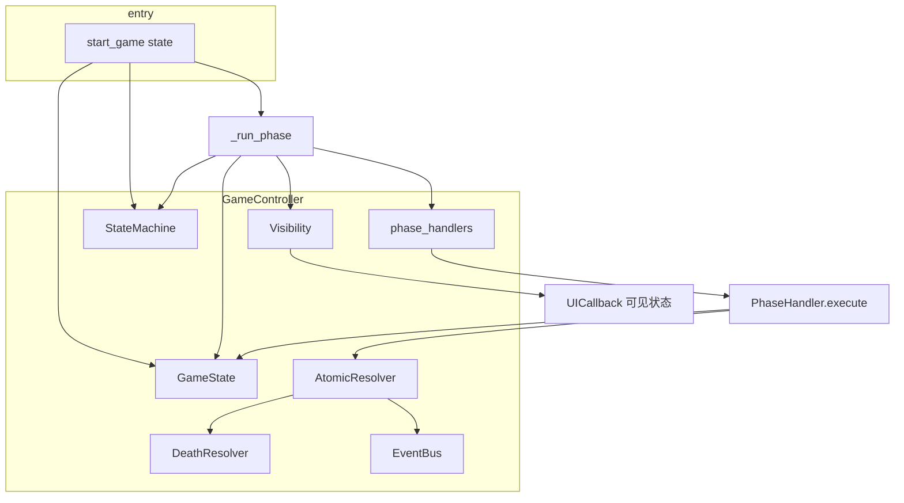
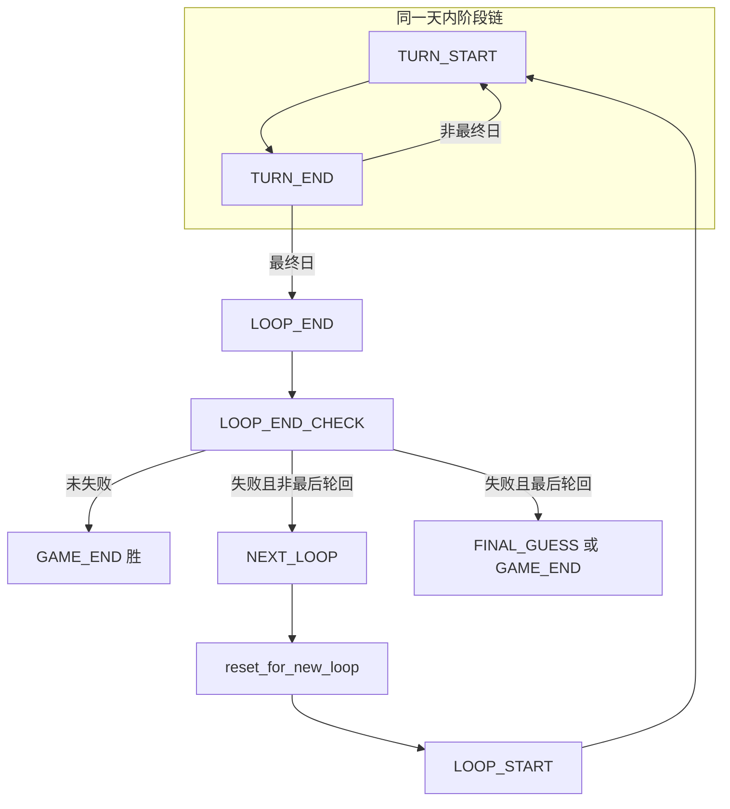

# 惨剧轮回 — 引擎运作说明

本文档基于当前代码整理：**从 `GameController.start_game` 出发的主链路**、**各类职责与关系**、**轮回与天数的循环结构**，以及与既有「骨架 / 缺口」说明合并。

---

## 1. 总览：三类组件

| 组件 | 职责 |
|------|------|
| **StateMachine** | 只决定「下一阶段是哪个 `GamePhase`」，不做业务规则、不改角色。 |
| **GameState** | 唯一可变游戏世界：角色、剧本、手牌、失败标记、轮回/天数等。 |
| **PhaseHandler** | 当前阶段业务：读/写 `GameState`，返回 `PhaseComplete` / `WaitForInput` / `ForceLoopEnd`。 |

结算可走 **AtomicResolver**（读快照 → 写 mutations → 事件链），死亡走 **DeathResolver**。展示给 UI 前经 **Visibility** 按角色裁剪（尤其身份）。

---

## 2. 从 `start_game` 开始的主链路

### 2.1 `start_game(state)` 做了什么

1. **`self.state = state`** — 使用调用方已构造好的 `GameState`（含 `script`、`characters` 等）。控制器**不负责**从 JSON 加载；聚合根由外部注入。
2. **`self.state_machine.reset()`** — 状态机回到 `GAME_PREPARE`，清空虚线跳转标记。
3. **`self.state.current_phase = GAME_PREPARE`** — 与状态机对齐，便于对外展示。
4. **`_run_phase()`** — 进入调度主循环的第一拍。

### 2.2 `create_phase_handlers` 与 `phase_handlers`

构造时执行：

```python
self.phase_handlers = create_phase_handlers(self.event_bus, self.atomic_resolver)
```

作用：建立 **`dict[GamePhase, PhaseHandler]`**，每个阶段对应一个已注入 **EventBus** 与 **AtomicResolver** 的处理器实例。

`_run_phase` 中：`handler = self.phase_handlers.get(phase)`，再 `signal = handler.execute(self.state)`。若无 handler，则直接 `advance`。

### 2.3 `_run_phase`（每一「拍」）

1. 以 **`state_machine.current_phase`** 为准，写回 **`state.current_phase`**。
2. **`_notify_phase_change()`** — 默认用 `Visibility.filter_for_role(state, PROTAGONIST_0)` 得到 `VisibleGameState`，调用 `UICallback.on_phase_changed`。**不修改**权威状态。
3. **`GAME_END`** → `_handle_game_end()`（根据 `protagonist_dead`、`failure_flags` 判定胜负）。
4. **`NEXT_LOOP`** → **`state.reset_for_new_loop()`**，再 **`_advance_and_run()`**（见第 4 节）。
5. 否则取 **PhaseHandler**，执行 **`execute(state)`**，再 **`_handle_signal(signal)`**。

### 2.4 `_handle_signal`

| 信号 | 行为 |
|------|------|
| **PhaseComplete** | `_advance_and_run()` |
| **WaitForInput** | 保存 `callback`，`on_wait_for_input`；用户 **`provide_input(choice)`** 后执行 callback，再继续处理返回值。 |
| **ForceLoopEnd** | `state_machine.force_loop_end()`，下次 `advance()` 虚线跳到 `LOOP_END`。 |

### 2.5 `_advance_and_run`

1. 调用 **`state_machine.advance(...)`**，参数来自 **`GameState`**：`is_final_day`、`failure_flags`、`is_last_loop`、`protagonist_dead`、`has_final_guess` 等。
2. 若从 **`TURN_END`** 进入 **`TURN_START`**（且非结束分支），会 **`state.advance_day()`** 推进天数。
3. 递归 **`_run_phase()`**。

**要点**：状态机**不读身份**；分支只依赖传入的布尔量与当前阶段。

---

## 3. 类关系（简图）



---

## 4. 轮回与天数的循环关系

### 4.1 两条时间轴

| 概念 | 存放位置 | 谁推进 |
|------|----------|--------|
| **阶段** `GamePhase` | `StateMachine.current_phase`（并同步到 `state.current_phase`） | `advance()`、`NEXT_LOOP`、`GAME_END` 等 |
| **轮回 / 天** | `GameState.current_loop`、`current_day`（上限来自 `script`） | `advance_day()` 在 `_advance_and_run`；`reset_for_new_loop()` 在 `NEXT_LOOP` |

### 4.2 一天内的阶段链（小循环）

线性表连接 `GAME_PREPARE` … 直至 **`TURN_END`**。`TURN_END` 之后由 **`_branch_turn_end(is_final_day)`** 分支：

- **非最终日** → 下一阶段 **`TURN_START`**（同一天结束、新一天开始）。`GameController` 在检测到从 `TURN_END` 进到 `TURN_START` 时调用 **`state.advance_day()`**。
- **最终日** → **`LOOP_END`**，进入轮回收尾流程。

### 4.3 轮回级大循环（`NEXT_LOOP` → `LOOP_START`）

`LOOP_END` → `LOOP_END_CHECK` 后，`advance()` 进入 **`_branch_loop_end_check`**：

- **未失败**（无 `failure_flags` 且主人公未死）→ **`GAME_END`**（主人公胜利条件 A）。
- **失败且非最后轮回** → **`NEXT_LOOP`**。  
  **`GameController._run_phase`** 对 **`NEXT_LOOP`** 特殊处理：**不跑 Handler**，先 **`state.reset_for_new_loop()`**，再 **`_advance_and_run()`**。状态机中 **`NEXT_LOOP` → `LOOP_START`**，新轮回从 **`LOOP_START`** 继续。
- **失败且最后轮回** → **`FINAL_GUESS`** 或 **`GAME_END`**（视 `has_final_guess`）。

### 4.4 循环结构简图



**跨轮回重置**：仅在 **`NEXT_LOOP`** 路径调用 **`GameState.reset_for_new_loop()`**（角色回初始位置、清指示物等，见 `CharacterState.reset_for_new_loop`）。

---

## 5. 状态机、身份、改角色 — 对照表

| 需求 | 位置 |
|------|------|
| **当前阶段** | `controller.state_machine.current_phase` 与 `controller.state.current_phase` |
| **权威身份与角色** | `state.characters[id]`（`CharacterState.identity_id`、`revealed` 等）；剧本静态信息在 `state.script` |
| **UI 可见身份** | `Visibility.filter_for_role` / `get_visible_role`：主人公侧未公开为 `"???"`，剧作家侧见真实身份 |
| **改变角色（位置、生死、指示物）** | 在 **`PhaseHandler.execute`** 或 **`AtomicResolver`** 等路径修改 `state`，**不要**指望状态机替你改 |
| **轮回重置角色** | `NEXT_LOOP` → `reset_for_new_loop()` |

### 5.1 角色初始位置（特殊情况）

规则上存在：剧本决定多初始区域、手下每轮回由剧作家决定、神灵/转校生延迟登场等。**数据模型**上已有 `initial_area`、`entry_loop`、`entry_day` 等字段或预留；**剧本层** `CharacterSetup` 尚无 `initial_area` 覆盖；**阶段逻辑**尚未完整实现上述特例。详见 `PLAN.md` 与 `CharacterState` 注释。

---

## 6. 结算与死亡（摘要）

### 6.1 AtomicResolver

读：在快照上 plan 出 mutations。  
写：批量写回 `GameState`。  
触发：队列处理链式触发，再做终局裁定（含同时裁定优先级）。

文件：`engine/resolvers/atomic_resolver.py`。

### 6.2 DeathResolver

`process_death()`：不死特性 → 护卫消耗 → 否则标记死亡。  
文件：`engine/resolvers/death_resolver.py`。

### 6.3 EventBus 与 Visibility

**EventBus**：引擎内发布订阅（死亡、token 变更、身份公开等）。  
**Visibility**：阶段变化时给 UI **过滤可见状态**（默认主人公视角）；规则见 `visibility.py` 头部注释。

---

## 7. 当前能跑到哪与主要缺口（与旧版说明一致）

**能跑：**

- 状态机主干、阶段切换、等待输入挂起、轮回重置、终局判定骨架。

**缺口（关键）：**

- `WaitForInput.callback` 许多阶段尚未与真实回填逻辑闭环。
- `ACTION_RESOLVE` / `INCIDENT` / `TURN_END` / `LOOP_END_CHECK` 等业务规则未完成。
- `has_final_guess` 仍硬编码为 `True`（未读模组配置）。
- 身份能力触发与 `event_bus` 注册未完全闭环。

---

## 8. 核心文件索引

| 文件 | 作用 |
|------|------|
| `engine/game_controller.py` | 调度、`start_game`、`_run_phase`、`provide_input` |
| `engine/state_machine.py` | 阶段转换表与分支 |
| `engine/phases/phase_base.py` | `PhaseHandler`、`create_phase_handlers` |
| `engine/game_state.py` | `GameState`、轮回重置、`advance_day` |
| `engine/visibility.py` | 信息边界、`VisibleGameState` |
| `engine/resolvers/atomic_resolver.py` | 原子结算 |
| `engine/resolvers/death_resolver.py` | 死亡裁定 |
| `engine/event_bus.py` | 事件总线 |

---

*文档与仓库代码同步整理；若实现推进，请以源码为准并更新本节。*

---

## 附录：生成 HTML

在仓库根目录执行（需已安装 `requirements-dev.txt` 中的 `markdown`）：

```bash
python scripts/md_to_html_engine_doc.py
```

将生成与本文同名的 **`引擎运作.html`**，可用浏览器打开；文中的 Mermaid 图需联网加载 CDN（`mermaid@10`）。
